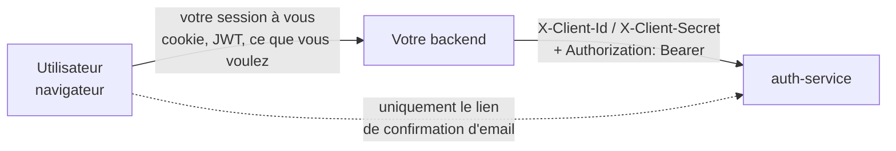
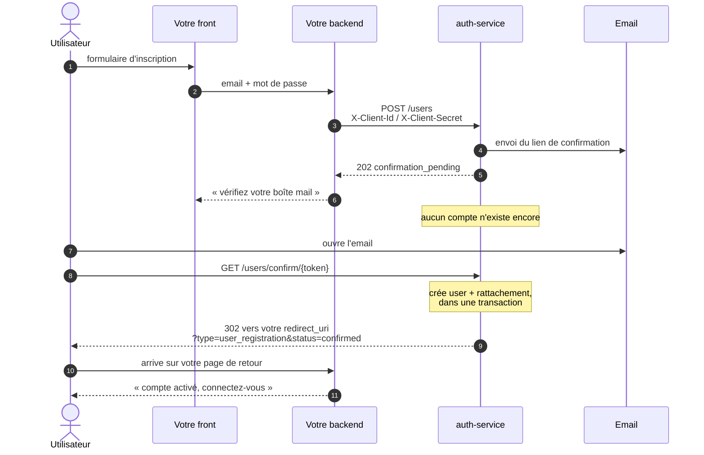
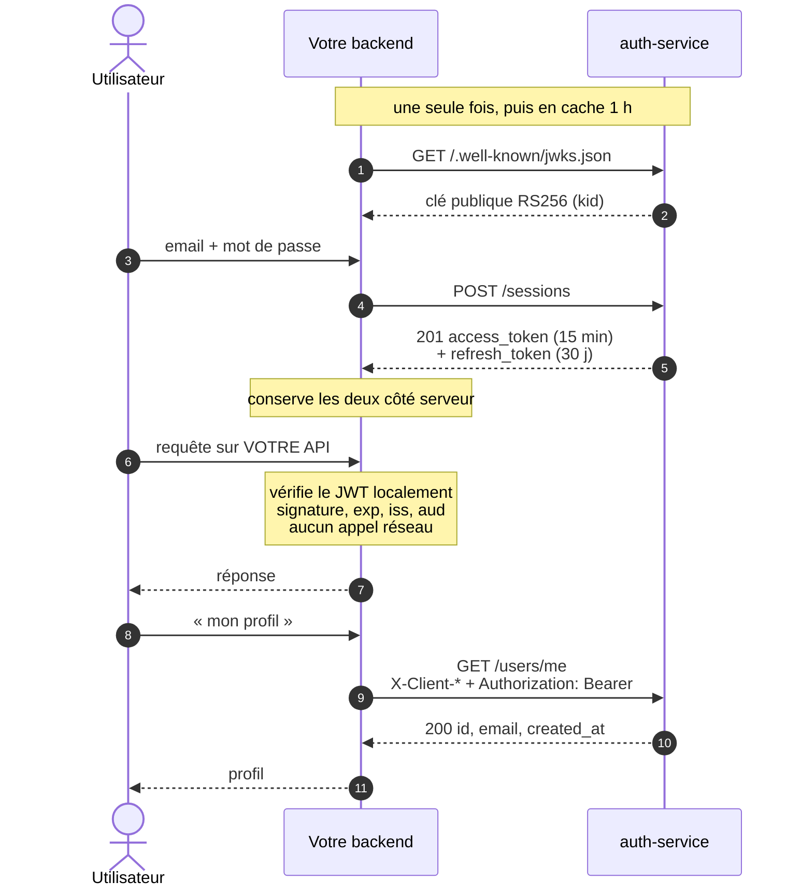
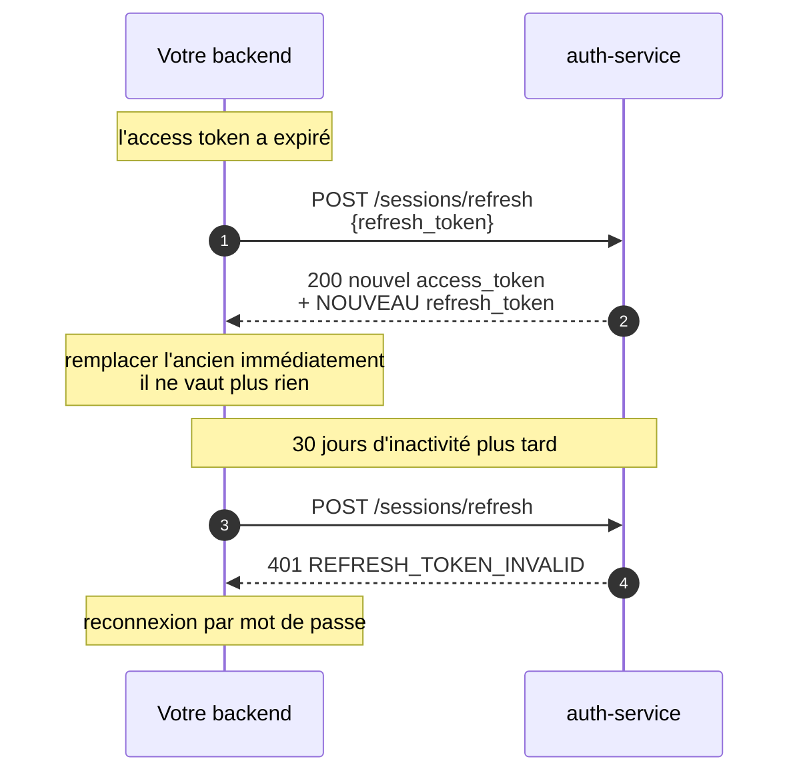
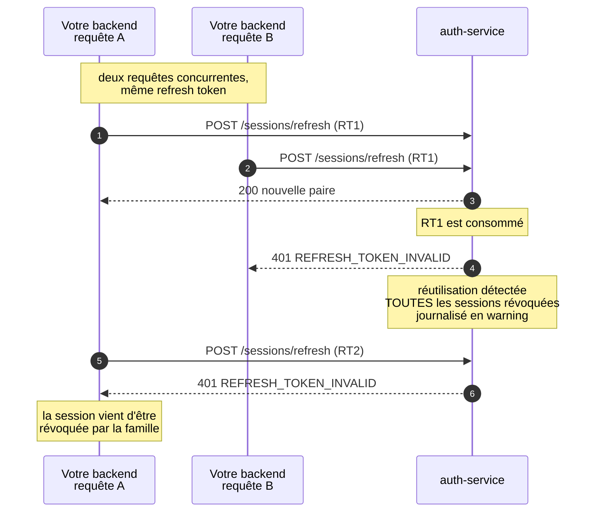
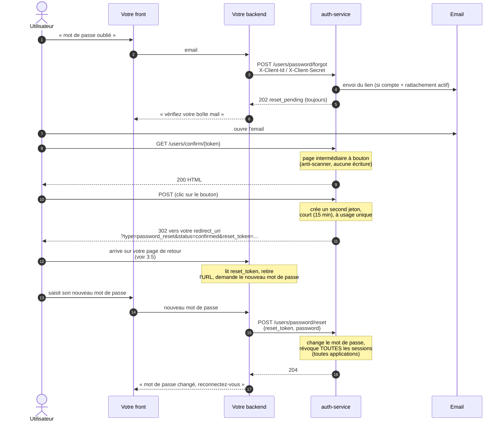
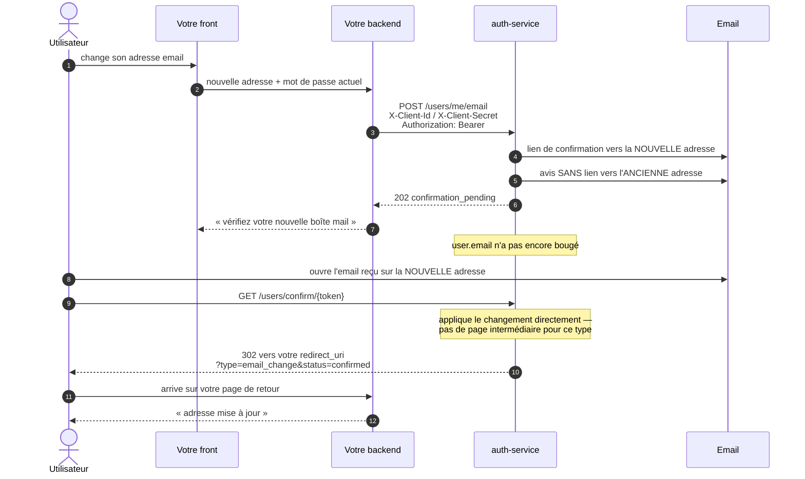

# Intégrer `auth-service` dans une application cliente
 
Ce guide s'adresse au développeur d'une **application cliente** — une « app tierce » qui
délègue l'authentification de ses utilisateurs à `auth-service`. Il décrit le contrat HTTP,
les flux, et donne une implémentation de référence en PHP.
 
Pour l'architecture du service lui-même et ses décisions de conception, voir
[`CLAUDE.md`](../CLAUDE.md) ; pour le détail route par route, [`README.md`](../README.md).
 
---
 
## 1. Le modèle en une page
 
**`auth-service` authentifie les utilisateurs finaux de votre application** : des personnes,
qui se connectent avec une adresse email et un mot de passe. Que votre produit s'adresse à
des particuliers ou à des entreprises ne change rien à son fonctionnement.
 
Le mot **« B2B »** employé ailleurs dans ce dépôt qualifie la relation entre **votre
application et le service** — plusieurs applications clientes partagent la même instance,
chacune avec ses propres utilisateurs, sans jamais se voir. Il ne dit rien de la nature de
vos utilisateurs à vous.
 
### « Serveur-à-serveur » ne veut pas dire « sans navigateur »
 
C'est le **backend** de votre application qui compose les requêtes vers `auth-service`,
jamais le navigateur de l'utilisateur. Celui-ci se connecte tout à fait normalement, sur
**votre** page de login, et conserve une session avec **votre** application — le mécanisme
de session que vous aviez avant d'utiliser ce service n'a pas à changer.
 

 
Ce qui change pour vous : votre backend ne vérifie plus un mot de passe dans sa propre base,
il l'échange contre une paire de tokens auprès d'`auth-service`, et **garde ces tokens côté
serveur**, rattachés à sa propre session. L'access token et le refresh token ne descendent
jamais dans le navigateur — le second vaut 30 jours, et le `client_secret` qui accompagne
chaque appel ne doit jamais quitter votre serveur.
 
Deux conséquences immédiates :
 
- **Aucune politique CORS n'est nécessaire** — il n'y en a pas, et il n'y en aura pas.
- **Aucune redirection vers `auth-service` n'a lieu au moment du login.** Malgré le
  vocabulaire familier — `client_id`, `client_secret`, `redirect_uri` — **ce n'est pas
  OAuth2** : pas de page de connexion hébergée par le service, pas de code d'autorisation à
  échanger. Le `redirect_uri` ne sert qu'à une chose, le retour du lien de confirmation
  d'email (section 2.1).
**Deux authentifications coexistent sur une même requête**, et elles ne partagent pas
d'en-tête :
 
| Qui | En-tête | Sur quelles routes |
| --- | --- | --- |
| Votre **application** | `X-Client-Id` + `X-Client-Secret` | toutes les routes d'API |
| L'**utilisateur** final | `Authorization: Bearer <access_token>` | `GET /users/me`, `GET /sessions`, `DELETE /sessions/{id}` |
 
**Une seule exception, atteinte par le navigateur :** le lien de confirmation reçu par
email, `GET /users/confirm/{token}`. Un navigateur ne peut pas porter `X-Client-Secret` —
c'est pourquoi cette route est publique et repose sur l'imprévisibilité du token. Elle
redirige ensuite vers **votre** `redirect_uri`.
 
### Ce dont vous avez besoin pour démarrer
 
Vous n'avez vous-même aucun accès en libre-service au registre des applications : votre
entrée y est créée par l'exploitant du service, qui vous transmet ensuite trois valeurs.
 
| Valeur | Rôle |
| --- | --- |
| `client_id` | identifie votre application, circule en clair dans `X-Client-Id` |
| `client_secret` | **secret**, à garder côté serveur uniquement (variable d'environnement, jamais versionné) |
| `redirect_uri` | l'URL de **votre** application vers laquelle l'utilisateur est renvoyé après avoir cliqué le lien de confirmation |
 
---
 
## 2. Les flux
 
### 2.1 Inscription et confirmation
 
Rien n'est créé tant que l'utilisateur n'a pas cliqué le lien reçu par email. `POST /users`
n'enregistre qu'une demande en attente.
 

 
**Deux paramètres** vous reviennent sur votre `redirect_uri`, dans cet ordre : `type` puis
`status`.
 
`type` vaut toujours `user_registration` pour ce flux — c'est la nature de la demande
confirmée. `auth-service` porte en interne un mécanisme de confirmation générique, commun
à plusieurs types de demandes (inscription aujourd'hui, d'autres types pourront s'y
ajouter) ; `type` vous permet de distinguer sans ambiguïté de quelle demande relève le
`status` qui suit, y compris si votre `redirect_uri` sert plusieurs flux.
 
**Le paramètre `status`** prend trois valeurs :
 
| `status` | Signification | Ce que votre page doit dire |
| --- | --- | --- |
| `confirmed` | compte activé | inviter à se connecter |
| `already_confirmed` | lien déjà utilisé, ou second lien pour la même demande | inviter à se connecter — ce n'est **pas** une erreur |
| `expired` | lien vieux de plus de 24 h | proposer `POST /users/confirm/resend` |
 
Si votre `redirect_uri` porte déjà une chaîne de requête, `type` et `status` sont ajoutés à
la suite. Un token totalement inconnu n'atteint jamais votre application : `auth-service`
n'a alors aucune application à qui rediriger et répond une page `404`.
 
**Une page intermédiaire, pour certains types.** L'inscription n'y passe jamais, mais un
autre type peut faire suivre le lien par une page intermédiaire servie par `auth-service`
lui-même, avec un simple bouton à cliquer avant que l'action ne soit appliquée — une
protection contre les scanners de liens automatiques (client mail, antivirus) qui suivent
un lien sans intention réelle de l'utilisateur. C'est le cas de la réinitialisation de mot
de passe (section 2.5), seul type à s'en servir à ce jour. Cela ne change rien à ce que
vous recevez : la redirection finale porte les mêmes `type`/`status` que ci-dessus, une
fois le bouton cliqué.
 
**Une même adresse peut être resoumise** : cela crée un nouveau lien **sans invalider les
précédents**, pour qu'un email reçu en retard reste utilisable. C'est pourquoi
`already_confirmed` est un cas normal et non une erreur.
 
**Un même humain peut utiliser plusieurs applications clientes.** Si l'adresse est déjà
connue du service mais pas encore rattachée à votre application, `POST /users` fait un
**rattachement** au lieu d'une création — à condition que le mot de passe fourni soit le
bon. Vous n'avez rien à faire de particulier : la réponse est identique (`202`), et vous
n'apprenez pas si l'adresse était déjà connue.
 
### 2.2 Connexion, puis requêtes authentifiées
 

 
C'est **tout l'intérêt du RS256** : votre backend vérifie chaque access token avec la clé
publique, sans appeler `auth-service`. Vous n'appelez le service que pour les opérations
qui le nécessitent — connexion, rotation, profil, gestion des sessions.
 
### 2.3 Rotation du refresh token
 
L'access token expire au bout de **15 minutes**. Le refresh token permet d'en obtenir un
nouveau, et il est **à usage unique** : chaque rotation le remplace.
 

 
La durée de 30 jours est **glissante** : elle est recalculée à chaque rotation. Un
utilisateur actif reste connecté indéfiniment ; un utilisateur absent 30 jours doit se
reconnecter.
 
### 2.4 Détection de réutilisation — le piège à connaître
 
Rejouer un refresh token déjà consommé est interprété comme un **vol probable**. La réaction
est brutale et volontaire : **toutes** les sessions de cet utilisateur sur votre application
sont révoquées, tous appareils confondus.
 

 
**Conséquence pratique : sérialisez vos rotations.** Deux requêtes de votre application qui
rafraîchissent le même token en parallèle — deux onglets, deux appels d'API simultanés, un
worker et une requête web — déconnectent l'utilisateur partout. Un verrou par session
(Redis, `SELECT ... FOR UPDATE`, `flock`) autour de la rotation suffit à l'éviter ; la
section 3.4 en donne une implémentation.
 
### 2.5 Réinitialisation de mot de passe
 
Le jeton du lien email ne quitte **jamais votre backend côté navigateur** : c'est le
navigateur de l'utilisateur qui suit le lien (comme pour l'inscription, section 2.1), mais
la redirection finale vous remet un **second** jeton, court et à usage unique, que vous
transmettez vous-même à `POST /users/password/reset`.
 
Le `GET` du lien sert une **page intermédiaire à bouton**, hébergée par `auth-service`
lui-même, avant d'appliquer quoi que ce soit — une protection contre les scanners de liens
automatiques (client mail, antivirus) qui suivent un lien sans intention réelle de
l'utilisateur. Ce mécanisme existe dans `auth-service` depuis une version antérieure, mais
ce flux est le premier à s'en servir réellement : rien à faire de votre côté, votre
utilisateur voit simplement un bouton à cliquer avant la redirection vers vous.
 

 
**Pourquoi deux jetons, et pas un seul ?** Le premier (celui de l'email) ne voyage que
jusqu'au navigateur de l'utilisateur et à `auth-service` — il n'a pas besoin de vous
atteindre. Le second est celui qui compte pour vous : il est **court** (15 minutes, contre
1 heure pour le premier), **lié à votre application** (un jeton émis pour une autre
application est refusé), et **à usage unique**. C'est lui, et lui seul, que vous recevez
et renvoyez.
 
**`POST /users/password/forgot` répond toujours `202 {"status": "reset_pending"}`**, que
l'adresse corresponde à un compte ou non, qu'il soit rattaché à votre application ou non,
qu'un email parte réellement ou pas. C'est volontaire — voir 4, « anti-énumération » — et
`auth-service` introduit même un délai artificiel pour que les cas silencieux ne répondent
pas sensiblement plus vite que le cas réel. N'en déduisez donc jamais qu'un email a été
envoyé ; ne construisez pas non plus de logique cliente sur la vitesse de la réponse.
 
**`POST /users/password/reset` refuse tout jeton invalide avec un code unique**,
`400 RESET_TOKEN_INVALID` — jeton inconnu, expiré, déjà utilisé, ou obtenu pour une autre
application : cinq causes, une seule réponse, pour ne rien révéler de plus à un appelant
qu'un refus générique. `password` est soumis aux mêmes règles qu'à l'inscription (8 à 72
octets — voir section 2.1 et le contrat, section 4).
 
**Effet du succès, à anticiper côté produit.** `POST /users/password/reset` révoque
**toutes** les sessions actives de l'utilisateur, sur **toutes vos applications si vous en
avez plusieurs** avec la même instance `auth-service` — pas seulement l'appareil ou
l'application où la demande a été faite. L'utilisateur doit se reconnecter partout après
un reset ; c'est le prix d'un mot de passe qui vient d'être considéré comme potentiellement
compromis.
 
**Table `type`/`status` de ce flux :**
 
| `type` | `status` | Signification |
| --- | --- | --- |
| `password_reset` | `confirmed` | lien suivi avec succès, `reset_token` disponible dans la redirection |
| `password_reset` | `already_confirmed` | lien déjà cliqué (rouvert, ou second lien pour la même demande) |
| `password_reset` | `expired` | lien vieux de plus d'1 heure |
 
Comme pour l'inscription, un token totalement inconnu n'atteint jamais votre application —
`auth-service` n'a alors personne à qui rediriger et répond une page `404`.
 
**Anti-énumération.** `POST /users/password/forgot` ne vous dit jamais si l'adresse fournie
correspond à un compte connu de `auth-service`, ni si ce compte est rattaché à votre
application. Construisez votre page de confirmation en conséquence : un message générique
(« si un compte existe pour cette adresse, un email a été envoyé ») plutôt qu'une
confirmation qui révélerait l'existence du compte.
 
### 2.6 Changement d'email
 
Contrairement au reset de mot de passe, la demande connaît déjà tout ce qu'il faut
appliquer — la nouvelle adresse — un seul jeton suffit donc. Mais `user.email` ne change
**jamais** avant que ce jeton n'ait été ouvert : la possession de la nouvelle adresse doit
être prouvée avant qu'elle ne devienne celle du compte.
 

 
**Authentifiée deux fois**, comme `GET /users/me` : `X-Client-Id`/`X-Client-Secret` pour
votre application, ET `Authorization: Bearer <access_token>` pour l'utilisateur — c'est
lui qui demande un changement pour lui-même, jamais une action que votre backend
déclencherait seul. Le corps porte `email` (la nouvelle adresse) et `password` — le mot de
passe **actuel** de l'utilisateur, pas un nouveau secret à choisir : c'est une preuve
supplémentaire qu'un access token volé ne suffit pas à lui seul à détourner un compte.
 
**Aucune session n'est révoquée.** Contrairement à un reset de mot de passe, un changement
d'email n'est pas en soi un signal de compromission : l'access token utilisé pour la
demande reste valide après la confirmation, comme tous les autres.
 
**Deux emails sont envoyés**, à chaque demande : le lien de confirmation part vers la
**nouvelle** adresse, un simple avis **sans lien** part vers l'**ancienne** — une
invitation à réinitialiser le mot de passe en cas de doute, pour l'utilisateur qui ne
serait pas à l'origine de la demande.
 
**Refus possibles, avant l'envoi de tout email :**
 
| Code HTTP | Code d'erreur | Cause |
| --- | --- | --- |
| `400` | `VALIDATION_FAILED` | corps invalide, ou nouvelle adresse identique à l'actuelle |
| `403` | `ACCESS_REVOKED` | rattachement absent ou révoqué pour votre application |
| `401` | `INVALID_CREDENTIALS` | mot de passe fourni incorrect |
| `409` | `EMAIL_ALREADY_USED` | la nouvelle adresse est déjà celle d'un AUTRE compte |
| `429` | `RATE_LIMITED` | plafond d'envoi dépassé (`Retry-After` posé) — voir ci-dessous |
 
Le contrôle du mot de passe précède celui de l'adresse déjà prise : une session volée ne
suffit donc pas, à elle seule, à énumérer les adresses déjà enregistrées.
 
**Table `type`/`status` de ce flux**, y compris un statut propre à ce type :
 
| `type` | `status` | Signification |
| --- | --- | --- |
| `email_change` | `confirmed` | adresse changée avec succès |
| `email_change` | `already_confirmed` | lien déjà suivi (rouvert, ou l'adresse portait déjà cette valeur) |
| `email_change` | `expired` | lien vieux de plus d'1 heure |
| `email_change` | `email_taken` | la nouvelle adresse a été prise par un AUTRE compte entre la demande et l'ouverture du lien — rien n'est appliqué |
 
Pas de page intermédiaire pour ce type : suivre ce lien n'a d'autre effet que de faire
aboutir un changement que l'utilisateur authentifié vient lui-même de demander, comme pour
l'inscription (section 2.1).
 
**Budget d'emails partagé avec le reset de mot de passe.** Le rate limiting par adresse
(voir section 4) compte les emails par `subject`, et `email_change` partage le même
sujet — le `user_id` — que `password_reset`/`password_reset_grant` : une demande de
changement d'email et une demande de reset pour le même utilisateur puisent dans le MÊME
budget de 3 emails / 15 minutes, pas deux budgets séparés.
 
**Risque résiduel, assumé.** Un compte authentifié (session ET mot de passe) peut faire
partir un lien de confirmation vers une adresse tierce quelconque, dans la limite du rate
limiting ci-dessus. C'est inhérent au choix d'une preuve de possession différée par email
plutôt qu'immédiate : le pire effet est un email indésirable reçu par un tiers, jamais un
changement d'identité imposé — `user.email` ne bouge qu'à l'ouverture du lien par le
titulaire de la boîte visée.
 
---
 
## 3. Implémentation de référence en PHP
 
Deux dépendances :
 
```bash
composer require guzzlehttp/guzzle firebase/php-jwt
```
 
Trois variables d'environnement côté application cliente :
 
```dotenv
AUTH_SERVICE_URL=https://auth.fzed51.com
AUTH_CLIENT_ID=votre-client-id
AUTH_CLIENT_SECRET=votre-secret
```
 
### 3.1 Le client HTTP
 
```php
<?php
 
declare(strict_types=1);
 
namespace App\Auth;
 
use GuzzleHttp\Client;
use GuzzleHttp\Exception\ClientException;
use GuzzleHttp\Exception\GuzzleException;
 
/**
 * Enveloppe les appels serveur-à-serveur à auth-service.
 *
 * Les en-têtes X-Client-* sont posés une fois pour toutes : ils sont exigés sur toutes les
 * routes d'API, y compris celles qui portent déjà un Authorization: Bearer.
 */
final class AuthServiceClient
{
    private Client $http;
 
    public function __construct(string $baseUrl, string $clientId, string $clientSecret)
    {
        $this->http = new Client([
            'base_uri' => rtrim($baseUrl, '/') . '/',
            'timeout' => 5.0,
            'headers' => [
                'X-Client-Id' => $clientId,
                'X-Client-Secret' => $clientSecret,
                'Accept' => 'application/json',
            ],
            // Les 4xx lèvent une ClientException, convertie plus bas en AuthServiceException :
            // le code métier est ainsi lu une seule fois, au même endroit.
            'http_errors' => true,
        ]);
    }
 
    /**
     * Inscription OU rattachement — l'appelant n'a pas à distinguer les deux.
     *
     * @throws AuthServiceException 400 VALIDATION_FAILED, 401 INVALID_CREDENTIALS,
     *                              409 EMAIL_ALREADY_USED
     */
    public function register(string $email, string $password): void
    {
        $this->send('POST', 'users', ['email' => $email, 'password' => $password]);
    }
 
    /**
     * Réémet le lien de confirmation sans invalider les précédents.
     *
     * @throws AuthServiceException 404 NO_PENDING_REGISTRATION si aucune demande n'est
     *                              en cours — l'utilisateur doit repasser par register()
     */
    public function resendConfirmation(string $email): void
    {
        $this->send('POST', 'users/confirm/resend', ['email' => $email]);
    }
 
    /**
     * @return array{access_token: string, refresh_token: string, expires_in: int}
     * @throws AuthServiceException 401 INVALID_CREDENTIALS, 403 ACCESS_REVOKED
     */
    public function login(string $email, string $password): array
    {
        return $this->send('POST', 'sessions', ['email' => $email, 'password' => $password]);
    }
 
    /**
     * Échange un refresh token contre une NOUVELLE paire. Le token présenté ne vaut plus
     * rien après cet appel, qu'il ait été accepté ou non.
     *
     * @return array{access_token: string, refresh_token: string, expires_in: int}
     * @throws AuthServiceException 401 REFRESH_TOKEN_INVALID, 403 ACCESS_REVOKED
     */
    public function refresh(string $refreshToken): array
    {
        return $this->send('POST', 'sessions/refresh', ['refresh_token' => $refreshToken]);
    }
 
    /** @return array{id: string, email: string, created_at: string} */
    public function me(string $accessToken): array
    {
        return $this->send('GET', 'users/me', null, $accessToken);
    }
 
    /** @return array{sessions: list<array{id: string, device: string, created_at: string, last_used_at: string}>} */
    public function sessions(string $accessToken): array
    {
        return $this->send('GET', 'sessions', null, $accessToken);
    }
 
    /** Idempotent : révoquer une session déjà révoquée répond 204 comme la première fois. */
    public function revokeSession(string $accessToken, string $sessionId): void
    {
        $this->send('DELETE', 'sessions/' . rawurlencode($sessionId), null, $accessToken);
    }
 
    /**
     * @param array<string, mixed>|null $body
     * @return array<string, mixed>
     */
    private function send(string $method, string $path, ?array $body = null, ?string $accessToken = null): array
    {
        $options = [];
 
        if ($body !== null) {
            $options['json'] = $body;
        }
 
        if ($accessToken !== null) {
            $options['headers'] = ['Authorization' => 'Bearer ' . $accessToken];
        }
 
        try {
            $response = $this->http->request($method, $path, $options);
        } catch (ClientException $exception) {
            throw AuthServiceException::fromResponse($exception);
        } catch (GuzzleException $exception) {
            // Panne réseau, timeout, 5xx : à distinguer d'un refus métier, car ici
            // réessayer a du sens.
            throw new AuthServiceException('AUTH_SERVICE_UNAVAILABLE', $exception->getMessage(), 0, $exception);
        }
 
        $raw = (string) $response->getBody();
 
        if ($raw === '') {
            return [];
        }
 
        $decoded = json_decode($raw, true);
 
        return is_array($decoded) ? $decoded : [];
    }
}
```
 
### 3.2 Les erreurs
 
Toute erreur porte le même enveloppe JSON : `{"error": {"code": "...", "message": "..."}}`.
Le `code` est stable et machine-readable — **branchez-vous dessus**, jamais sur le message,
qui est destiné à l'humain et peut changer.
 
```php
<?php
 
declare(strict_types=1);
 
namespace App\Auth;
 
use GuzzleHttp\Exception\ClientException;
use RuntimeException;
use Throwable;
 
final class AuthServiceException extends RuntimeException
{
    public function __construct(
        public readonly string $errorCode,
        string $message,
        private readonly int $status = 0,
        ?Throwable $previous = null,
    ) {
        parent::__construct($message, 0, $previous);
    }
 
    public static function fromResponse(ClientException $exception): self
    {
        $response = $exception->getResponse();
        $decoded = json_decode((string) $response->getBody(), true);
 
        $code = 'UNKNOWN';
        $message = $exception->getMessage();
 
        if (is_array($decoded) && isset($decoded['error']) && is_array($decoded['error'])) {
            $code = is_string($decoded['error']['code'] ?? null) ? $decoded['error']['code'] : $code;
            $message = is_string($decoded['error']['message'] ?? null) ? $decoded['error']['message'] : $message;
        }
 
        return new self($code, $message, $response->getStatusCode(), $exception);
    }
 
    public function status(): int
    {
        return $this->status;
    }
}
```
 
Les codes que votre application rencontrera, et la réaction attendue :
 
| Code | Statut | Route | Que faire |
| --- | --- | --- | --- |
| `VALIDATION_FAILED` | 400 | inscription, login, rotation | corriger la saisie — email invalide, mot de passe hors de 8-72 octets |
| `INVALID_CREDENTIALS` | 401 | `POST /users`, `POST /sessions` | message générique « identifiants incorrects ». Recouvre volontairement plusieurs causes : ne cherchez pas à les distinguer |
| `EMAIL_ALREADY_USED` | 409 | `POST /users` | l'utilisateur a déjà un compte **sur votre application** : proposer la connexion |
| `NO_PENDING_REGISTRATION` | 404 | `.../resend` | aucune demande en cours : renvoyer vers l'inscription |
| `ACCESS_REVOKED` | 403 | `POST /sessions`, rotation | **c'est votre application** qui a retiré l'accès : afficher « accès suspendu », pas « identifiants incorrects » |
| `REFRESH_TOKEN_INVALID` | 401 | rotation | jeter la session locale, reconnexion par mot de passe |
| `INVALID_ACCESS_TOKEN` | 401 | routes Bearer | token absent, expiré, émis pour une autre application, ou dont le compte utilisateur n'existe plus côté service : rafraîchir, ou reconnexion si le rafraîchissement échoue aussi |
| `UNAUTHORIZED` | 401 | toutes | **votre** `client_id`/`client_secret` est absent ou faux — un défaut de configuration, pas une erreur utilisateur |
| `SESSION_NOT_FOUND` | 404 | `DELETE /sessions/{id}` | la session n'existe pas ou ne vous appartient pas |
 
`UNAUTHORIZED` mérite une alerte côté supervision : il ne dépend d'aucune action de
l'utilisateur, il signale que votre déploiement est mal configuré. C'est le code
générique du service (pas un `ErrorCode` métier dédié) — les quatre causes possibles
(en-tête absent, `client_id` inconnu, secret faux) sont volontairement indistinguables,
même principe que `INVALID_CREDENTIALS`.
 
### 3.3 Vérifier l'access token localement
 
C'est le cœur de l'intégration. Aucun appel réseau par requête : seulement la clé publique,
récupérée une fois et gardée en cache.
 
```php
<?php
 
declare(strict_types=1);
 
namespace App\Auth;
 
use Firebase\JWT\JWK;
use Firebase\JWT\JWT;
use Psr\SimpleCache\CacheInterface;
use UnexpectedValueException;
 
/**
 * Vérifie un access token avec la clé publique publiée par le JWKS.
 *
 * Les claims sont minimaux et volontairement : iss, sub (l'id utilisateur), aud (votre
 * client_id), iat, exp. Aucune donnée métier — pour l'email, appelez GET /users/me.
 */
final class AccessTokenVerifier
{
    private const JWKS_CACHE_KEY = 'auth-service.jwks';
 
    /** Le service publie Cache-Control: public, max-age=3600 sur cette route. */
    private const JWKS_TTL_SECONDS = 3600;
 
    public function __construct(
        private readonly string $baseUrl,
        private readonly string $clientId,
        private readonly CacheInterface $cache,
    ) {
    }
 
    /**
     * @return array{userId: string, expiresAt: int}
     * @throws InvalidAccessToken signature fausse, token expiré, ou émis pour une autre application
     */
    public function verify(string $accessToken): array
    {
        // Tolérance d'horloge : sans elle, quelques secondes de dérive entre votre serveur
        // et celui d'auth-service rejettent un token parfaitement valide.
        JWT::$leeway = 60;
 
        try {
            $claims = JWT::decode($accessToken, JWK::parseKeySet($this->jwks()));
        } catch (UnexpectedValueException $exception) {
            // Un kid inconnu signifie le plus souvent une rotation de clé pendant que le
            // cache était encore chaud : on réessaie une fois avec un JWKS frais.
            $claims = JWT::decode($accessToken, JWK::parseKeySet($this->jwks(refresh: true)));
        }
 
        // firebase/php-jwt vérifie la signature et exp, PAS iss ni aud : à faire soi-même.
        // Sans ce contrôle, un token émis pour une AUTRE application cliente du même
        // service serait accepté par la vôtre.
        if ($claims->aud !== $this->clientId) {
            throw new InvalidAccessToken('Token émis pour une autre application.');
        }
 
        if ($claims->iss !== $this->baseUrl) {
            throw new InvalidAccessToken('Émetteur inattendu.');
        }
 
        return ['userId' => $claims->sub, 'expiresAt' => $claims->exp];
    }
 
    /** @return array{keys: list<array<string, string>>} */
    private function jwks(bool $refresh = false): array
    {
        if (!$refresh) {
            $cached = $this->cache->get(self::JWKS_CACHE_KEY);
 
            if (is_array($cached)) {
                return $cached;
            }
        }
 
        $raw = file_get_contents($this->baseUrl . '/.well-known/jwks.json');
 
        if ($raw === false) {
            throw new InvalidAccessToken('JWKS injoignable.');
        }
 
        $jwks = json_decode($raw, true);
 
        if (!is_array($jwks) || !isset($jwks['keys'])) {
            throw new InvalidAccessToken('JWKS malformé.');
        }
 
        $this->cache->set(self::JWKS_CACHE_KEY, $jwks, self::JWKS_TTL_SECONDS);
 
        return $jwks;
    }
}
```
 
Trois points que l'on oublie souvent, et qui sont tous des trous de sécurité :
 
1. **Vérifier `aud`.** `firebase/php-jwt` contrôle la signature et l'expiration, pas
   l'audience. Le service étant multi-tenant, un token valide émis pour une autre
   application cliente porte la même signature — seul `aud` le distingue.
2. **Mettre le JWKS en cache, mais pas éternellement.** Le service publie
   `Cache-Control: max-age=3600`. Une rotation de clé publie plusieurs clés en parallèle,
   distinguées par leur `kid` : re-télécharger sur `kid` inconnu suffit à traverser la
   transition sans interruption.
3. **Prévoir une tolérance d'horloge.** 60 secondes de `leeway` évitent des rejets
   inexplicables sur un token émis « dans le futur » par une horloge légèrement en avance.
### 3.4 Rafraîchir sans se faire déconnecter
 
Rappel de la section 2.4 : deux rotations concurrentes sur le même refresh token révoquent
toutes les sessions de l'utilisateur. Le verrou n'est pas une optimisation, c'est une
condition de correction.
 
```php
<?php
 
declare(strict_types=1);
 
namespace App\Auth;
 
/**
 * Fournit un access token valide, en rafraîchissant si nécessaire.
 *
 * Le verrou est le point important : sans lui, deux requêtes concurrentes de votre
 * application présentent le même refresh token, auth-service y voit une réutilisation et
 * révoque TOUTES les sessions de l'utilisateur (voir docs/auth-service-integration.md, section 2.4).
 */
final class TokenProvider
{
    /** Marge avant expiration : ne pas partir en requête avec un token qui expire en route. */
    private const REFRESH_MARGIN_SECONDS = 60;
 
    public function __construct(
        private readonly AuthServiceClient $client,
        private readonly SessionStore $store,
        private readonly Lock $lock,
    ) {
    }
 
    public function accessTokenFor(string $userId): string
    {
        $tokens = $this->store->load($userId);
 
        if ($tokens->expiresAt > time() + self::REFRESH_MARGIN_SECONDS) {
            return $tokens->accessToken;
        }
 
        return $this->lock->withLock('auth-refresh:' . $userId, function () use ($userId): string {
            // Relecture DANS le verrou : une autre requête a pu rafraîchir pendant
            // l'attente, auquel cas il n'y a plus rien à faire.
            $tokens = $this->store->load($userId);
 
            if ($tokens->expiresAt > time() + self::REFRESH_MARGIN_SECONDS) {
                return $tokens->accessToken;
            }
 
            try {
                $fresh = $this->client->refresh($tokens->refreshToken);
            } catch (AuthServiceException $exception) {
                // REFRESH_TOKEN_INVALID comme ACCESS_REVOKED sont définitifs : la session
                // locale ne vaut plus rien, l'utilisateur doit se reconnecter.
                $this->store->forget($userId);
 
                throw $exception;
            }
 
            $this->store->save($userId, $fresh);
 
            return $fresh['access_token'];
        });
    }
}
```
 
### 3.5 La page de retour de confirmation
 
Le seul endroit où votre application est atteinte par le navigateur de l'utilisateur — pour
les deux flux qui y redirigent, inscription (2.1) et reset de mot de passe (2.5). C'est
`type` qui les distingue si votre `redirect_uri` sert les deux.
 
```php
<?php
 
// GET /auth/callback — l'URL déclarée comme redirect_uri dans le registre.
 
$type = $_GET['type'] ?? '';
$status = $_GET['status'] ?? '';
 
$message = match ([$type, $status]) {
    ['user_registration', 'confirmed'] => 'Votre compte est activé. Vous pouvez vous connecter.',
    // Cas normal, pas une erreur : plusieurs liens valides peuvent coexister, et un lien
    // déjà cliqué peut être rouvert.
    ['user_registration', 'already_confirmed'] => 'Ce compte est déjà activé. Vous pouvez vous connecter.',
    ['user_registration', 'expired'] => 'Ce lien a expiré. Demandez-en un nouveau.',
    default => null,
};
 
// Le flux de reset (2.5) ne se contente pas d'un message : status=confirmed porte un
// reset_token qu'il faut consommer, PAS afficher tel quel.
if ($type === 'password_reset' && $status === 'confirmed') {
    $resetToken = $_GET['reset_token'] ?? '';
 
    // 1. Consommez ce jeton CÔTÉ SERVEUR immédiatement — stockez-le en session serveur,
    //    ou embarquez-le (signé/chiffré si vous préférez) dans le formulaire de nouveau
    //    mot de passe que vous allez afficher. Il expire dans 15 minutes et ne sert
    //    qu'une fois : ne le faites pas voyager plus que nécessaire.
    // 2. Ne chargez AUCUNE ressource tierce sur cette page (script, police, image externe)
    //    tant que reset_token figure dans l'URL — un tiers pourrait le voir via son propre
    //    log de requêtes.
    // 3. Retirez-le de l'URL après lecture, par exemple avec l'historique du navigateur :
    //    history.replaceState(null, '', location.pathname) côté client, ou une redirection
    //    302 serveur vers une URL sans reset_token avant même de rendre la page.
    // 4. Affichez un formulaire de nouveau mot de passe, qui appellera POST
    //    /users/password/reset avec ce jeton (voir 2.5).
}
```
 
Trois consignes valent pour cette page **en général**, pas seulement pour le reset — un
jeton dans une URL (le reset_token, mais aussi tout paramètre sensible qu'un futur flux
ajouterait) est aussi sensible qu'un mot de passe le temps qu'il vit :
 
- envoyez `Referrer-Policy: no-referrer` sur cette réponse, pour qu'aucun lien sortant ne
  fasse fuiter l'URL complète (donc le jeton) via l'en-tête `Referer` ;
- ne chargez aucune ressource tierce (CDN, police, tracker) tant qu'un jeton figure encore
  dans l'URL de la page ;
- retirez le jeton de l'URL dès qu'il a été lu, avant que l'utilisateur ne puisse la
  copier, la partager, ou que votre outil d'analytique ne la journalise.
---
 
## 4. Le contrat, et ce qu'il ne promet pas
 
Six comportements ne se devinent pas à la lecture des routes. Les ignorer produit des
bugs difficiles à diagnostiquer.
 
**La révocation n'est pas instantanée.** `DELETE /sessions/{id}` empêche le
*renouvellement*, pas l'usage de l'access token déjà émis. Celui-ci reste valide jusqu'à son
`exp`, **au plus 15 minutes**. C'est le prix assumé du JWT stateless — aucun appel réseau par
requête. Si une de vos opérations exige une coupure immédiate, vérifiez vous-même l'état de
la session sur cette opération-là, via `GET /sessions`.
 
**L'access token n'est pas un identifiant de connexion.** Deux tokens émis dans la même
seconde pour le même utilisateur sont **strictement identiques** : RS256 est déterministe,
les claims ne portent pas de `jti`, et `iat`/`exp` sont à la seconde. Ne vous en servez pas
comme clé de déduplication, de journalisation ou de cache.
 
**Le refresh token est à usage unique et sa rotation est destructive en cas de rejeu.**
Voir la section 2.4 : sérialisez.
 
**Le service authentifie, il n'autorise pas.** Il ne connaît ni rôles ni permissions —
c'est délibéré, et cela reste votre responsabilité. `sub` vous donne un identifiant
utilisateur stable ; les droits attachés à cet identifiant vivent chez vous.
 
**`POST /users` et `POST /users/confirm/resend` sont limitées en débit.** Deux plafonds
indépendants, chacun sur sa propre fenêtre glissante : au plus **3 emails par 15 minutes**
pour une même adresse, et au plus **100 emails par heure** pour votre application, tous
utilisateurs confondus. Un dépassement de l'un ou l'autre répond `429` avec
`{"error": {"code": "RATE_LIMITED", ...}}` et un en-tête **`Retry-After`** (en secondes) —
attendez ce délai avant de réessayer plutôt que de le deviner. C'est une limite souple :
elle protège le quota SMTP d'OVH (environ **200 emails/heure**), pas une garantie de
facturation, et un léger dépassement occasionnel reste possible sous forte concurrence. Si
votre application déclenche des inscriptions en masse, protégez-vous en amont malgré tout —
ces plafonds sont un filet, pas un plan de capacité.
 
**`POST /users/password/forgot` est plafonnée aussi, mais ne répond JAMAIS `429`.** Même
mécanisme que ci-dessus (voir 2.5), sauf qu'un dépassement y est traité comme n'importe
quelle autre issue silencieuse : `202 {"status": "reset_pending"}`, sans email envoyé —
cohérent avec le principe d'anti-énumération de cette route, qui ne doit jamais se
comporter différemment selon ce qu'elle sait en interne. N'attendez donc pas de `429` sur
cette route précise, même en cas d'abus réel.
 
**Un reset de mot de passe déconnecte l'utilisateur PARTOUT, pas seulement chez vous.**
`POST /users/password/reset` révoque toutes les sessions actives de l'utilisateur sur
**toutes** les applications rattachées à la même instance `auth-service` (voir 2.5) — si
vous n'êtes pas seul sur cette instance, une autre application peut voir ses sessions
coupées par un reset initié chez vous, et réciproquement.
 
**`POST /users/me/email` partage son budget de rate limiting avec le reset de mot de
passe.** Les deux plafonnent par `subject`, et ce sujet est le `user_id` pour les trois
types `password_reset`/`password_reset_grant`/`email_change` (voir 2.6) : un même
utilisateur qui enchaînerait une demande de reset puis une demande de changement d'email
dans la même fenêtre de 15 minutes peut se voir répondre `429` sur la seconde, alors même
qu'aucune des deux routes n'a, prise isolément, atteint son propre plafond apparent.
Contrairement à `POST /users/password/forgot`, `POST /users/me/email` répond bien `429`
sur ce dépassement — ce n'est pas une route anti-énumération, l'appelant est déjà
authentifié.
 
---
 
## 5. Vérifier son intégration
 
Le service expose deux routes publiques, sans authentification, utiles à votre supervision :
 
```bash
curl -s https://auth.fzed51.com/health
# {"status":"ok"}
 
curl -s https://auth.fzed51.com/.well-known/jwks.json
# {"keys":[{"kty":"RSA","use":"sig","alg":"RS256","kid":"2026-09","n":"...","e":"..."}]}
```
 
Le parcours minimal à rejouer après une mise en service, avec vos propres identifiants :
 
1. `POST /users` → `202`, puis l'email arrive **en boîte de réception**, pas en indésirable ;
2. le lien mène à votre `redirect_uri` avec `?type=user_registration&status=confirmed` ;
3. `POST /sessions` → `201`, et le `kid` du header de l'access token correspond à celui du JWKS ;
4. `GET /users/me` avec ce token → `200` ;
5. `POST /sessions/refresh` → `200`, puis le **même** appel rejoué → `401` et l'utilisateur
   est déconnecté partout : c'est la détection de réutilisation, et c'est le comportement
   attendu.
Un `401 UNAUTHORIZED` dès la première étape signale un `client_id` ou un `client_secret`
erroné, pas un problème d'utilisateur.
 